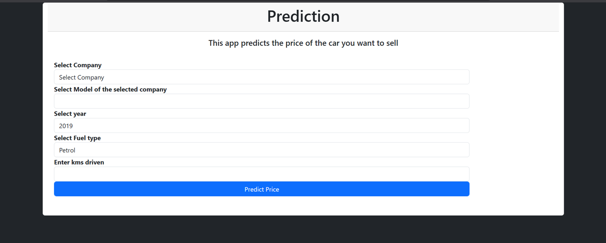
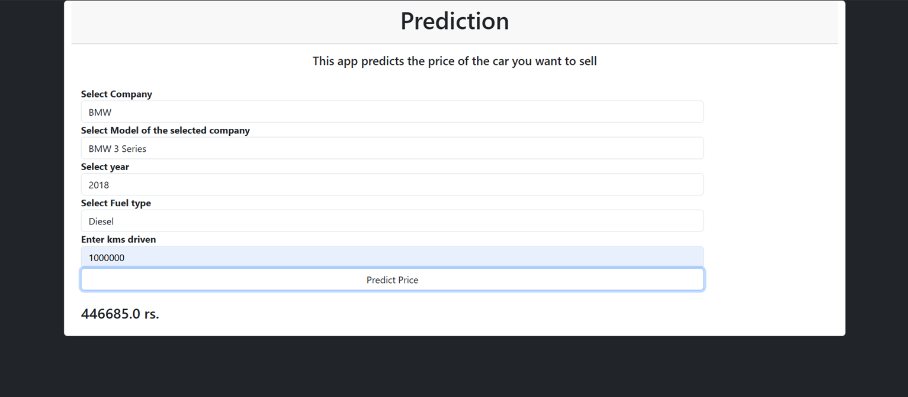
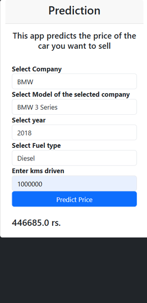

# 🚗 Car Price Predictor

A machine learning web application that predicts used car prices based on key vehicle attributes. Built with a Linear Regression model served through a Flask backend and a Bootstrap 5 + HTML5 frontend.

---

# Live Demo
https://car-price-predictor-1-y2xq.onrender.com/

---

## 📸 Overview

This project lets users input details about a used car — company, model, year, fuel type, and kilometers driven — and get an instant price prediction powered by a trained ML model.


---

## Screenshots

Homepage:


Prediction Result:



Mobile View:


---

## 🧠 How It Works

1. **Data Preprocessing** — Raw CSV data is cleaned: non-numeric years are dropped, prices formatted as "Ask For Price" are removed, and kilometers driven are parsed.
2. **Feature Engineering** — Car names are trimmed to the first three words. Categorical columns (`name`, `company`, `fuel_type`) are one-hot encoded.
3. **Model Training** — A `LinearRegression` model is wrapped in a `Pipeline` with a `ColumnTransformer`. The target variable (`Price`) is log-transformed for better performance. The best `random_state` is selected by iterating over 1000 train-test splits and picking the highest R² score.
4. **Persistence** — The trained pipeline is serialized using `pickle` and loaded at runtime by the Flask server.
5. **Prediction** — On form submission, the Flask backend reconstructs a DataFrame row from the inputs, runs it through the pipeline, and returns `exp(prediction)` to reverse the log transform.

---

## 🛠️ Tech Stack

| Frontend      ->      HTML5, Bootstrap 5 CSS 
| Backend       ->      Python, Flask, Flask-CORS 
| ML / Data     ->      scikit-learn, pandas, NumPy 
| Model Persistence  -> pickle 

---

## 📁 Project Structure

```
car-price-predictor/
│
├── app.py                  # Flask application (routes & prediction logic)
├── model_training.py       # Data preprocessing & model training script
├── model.pkl               # Serialized trained pipeline (generated after training)
├── new_df.csv              # Cleaned dataset (generated after training)
├── car_price_predictor.csv # Raw input dataset
│
├── templates/
│   └── index.html          # Main HTML5 page (Bootstrap 5)
│
└── static/
    └── style.css           # Custom CSS overrides
```

---

## ⚙️ Setup & Installation

### 1. Clone the Repository

```bash
git clone https://github.com/somil404/car-price-predictor.git
cd car-price-predictor
```

### 2. Create a Virtual Environment (Recommended)

```bash
python -m venv venv
source venv/bin/activate        # On Windows: venv\Scripts\activate
```

### 3. Install Dependencies

```bash
pip install flask flask-cors scikit-learn pandas numpy
```

### 4. Train the Model

Run the training script to preprocess the data and generate `model.pkl` and `new_df.csv`:

```bash
python model_training.py
```

> ⚠️ Make sure `car_price_predictor.csv` is present in the root directory before running this step.

### 5. Start the Flask Server

```bash
python app.py
```

The app will be accessible at `http://localhost:5000`.

---

## 🔌 API Reference

### `GET /`

Returns the main prediction form, populated with dynamic dropdowns from the dataset.

**Response:** Renders `index.html` with:
- `companies` — sorted list of car manufacturers
- `car_models` — sorted list of car model names
- `years` — available years (descending)
- `fuel_types` — available fuel types

---

### `POST /predict`

Accepts form data and returns the predicted price as a plain string.

**Form Fields:**

| Field         | Type      | Description                               |
|---------------|-----------|-------------------------------------------|
| `company`     | string    | Car manufacturer (e.g., `Maruti`)         |
| `car_models`  | string    | Car model name (e.g., `Maruti Swift VXI`) |
| `year`        | integer   | Year of manufacture (e.g., `2015`)        |
| `fuel_type`   | string    | Fuel type (`Petrol`, `Diesel`, `CNG`)     |
| `kilo_driven` | integer   | Kilometers driven (e.g., `45000`)         | 

**Response:** A plain-text string of the predicted price in INR, e.g.:

```
327500.0
```

**Error Response:**

```
Error in input
```

---

## 🧪 Model Performance

- **Algorithm:** Linear Regression inside a `sklearn` Pipeline
- **Preprocessing:** `OneHotEncoder` for categorical features (`name`, `company`, `fuel_type`); remaining numeric features passed through
- **Target Transform:** `log(Price)` — reversed with `exp()` at prediction time
- **Evaluation Metric:** R² Score
- **Best Split Selection:** The model is evaluated across 1000 random train-test splits (80/20) and the split yielding the highest R² score is used for the final model

---

## 🎨 Frontend Notes

- Built with **HTML5** and **Bootstrap 5 CSS** (CDN)
- Custom CSS (`style.css`) uses `box-sizing: border-box` reset, a dark background utility class (`.bg-dark` overridden to `#75767B`), and a `.mt-50` spacing helper
- The prediction result is displayed dynamically on the page without a full reload (via JavaScript `fetch` or form submission depending on your `index.html` implementation)

---

## 🚀 Deployment

The app binds to `0.0.0.0` and reads the `PORT` environment variable, making it compatible with platforms like **Heroku**, **Render**, or **Railway**:

```bash
PORT=8080 python app.py
```

For production, use Gunicorn:

```bash
pip install gunicorn
gunicorn app:app
```

---

## 📊 Dataset

The raw dataset (`car_price_predictor.csv`) should contain the following columns:

| Column       | Description                                                    |
|--------------|----------------------------------------------------------------|
| `name`       | Full car name (trimmed to first 3 words during preprocessing)  |
| `company`    | Car manufacturer                                               |
| `year`       | Year of manufacture (string, filtered to numeric only)         |
| `Price`      | Selling price in INR (rows with `"Ask For Price"` are dropped) |
| `kms_driven` | Kilometers driven (e.g., `"45,000 kms"`)                       |
| `fuel_type`  | Type of fuel used                                              |

---

## 🐛 Known Issues / Limitations

- The model is trained on a static dataset; predictions may be inaccurate for car models or years not present in training data.
- The `except` block in `/predict` catches all exceptions broadly — consider adding specific error handling for production use.
- The `RandomForestRegressor` is imported and configured in the training script but the final pipeline uses `LinearRegression`. You can swap it in the `Pipeline` for potentially better accuracy.

---

## 📄 License

This project is open-source and available under the [MIT License](LICENSE).

---

## 🙋‍♂️ Author

**Somil Agrawal**
username: somil404
